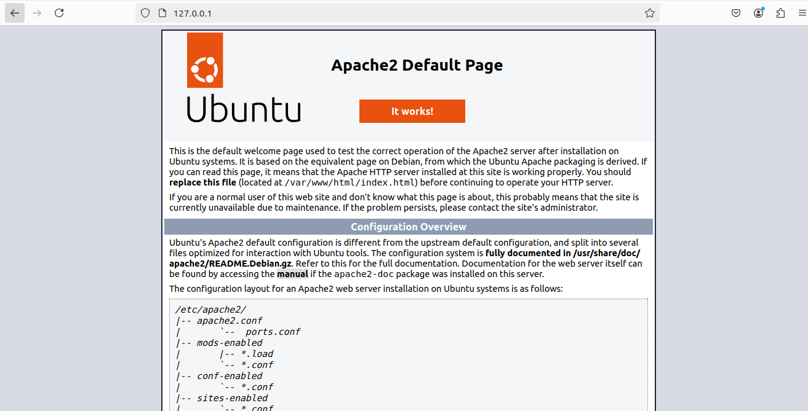
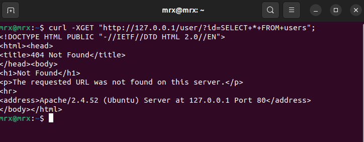

# Практическая работа № 3: Wazuh
## Выполнил Панков Никита Олегович, группа ББМО-01-23

## Ход работы

## Устанавливаем сервер Wazuh на виртуальную машину

## Главная страница Wazuh

## Следуя оффициальнйо инструкциии от Wazuh устанавливаем агент на наш клиент и после видим его в системе

## Уязвимости по умолчанию

## Настройка для проверки целостности файлов

## Настройка выявление уязвимостей

## Настройка скрытых процессов

## SQL-инъекции

### Установка Apache

## Главная страница Apache

### Настройка для мониторинга файлов сервера Apache

### Имитируем атаку

### Отчет о работе

