# Практическая работа №5

**Выполнил студент группы ББМО-01-23 Панков.Н.О**

Ход работы

1) Используя навыки полученный на предыдущем практическом занятии устанавливаем Wazuh и подключаем агента

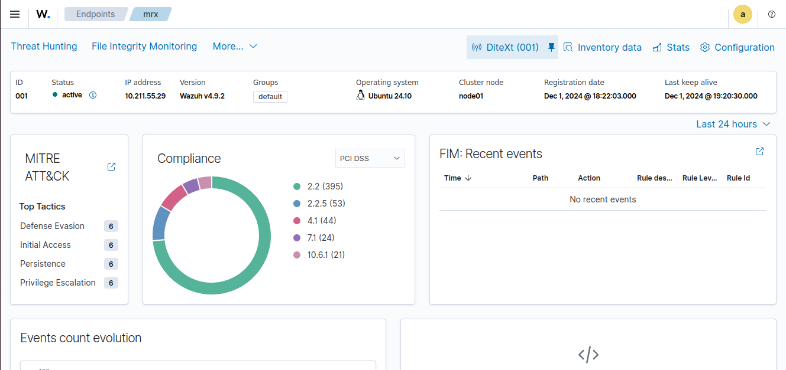

2) Устанавливаем и запускам Suricata

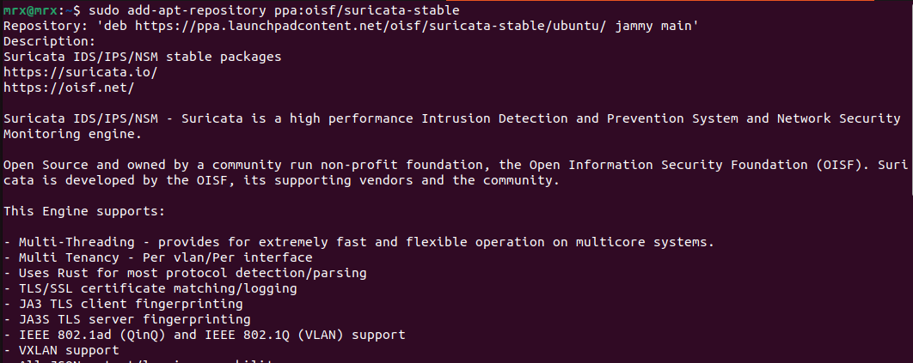

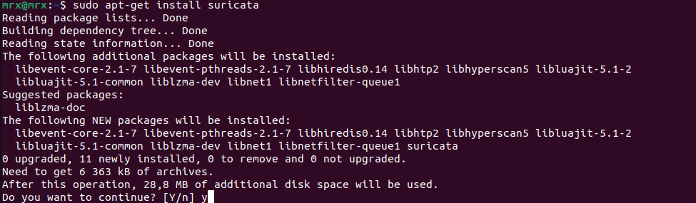

3) Скачиваем набор правил

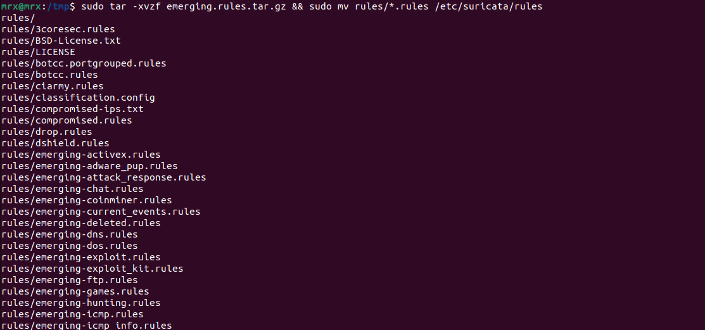

4) Настраиваем Suricata

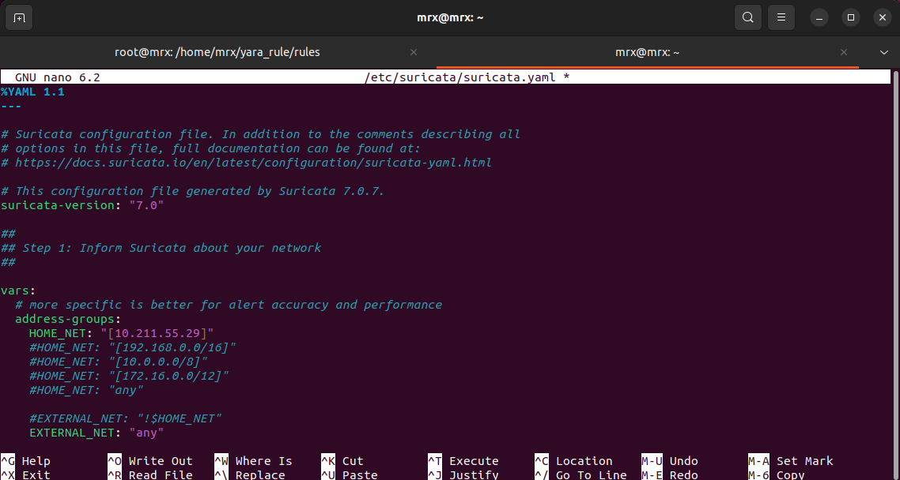

5) Подключаем логи Suricata в Wazuh

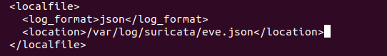

6) Устанавливаем и запускаем Apache

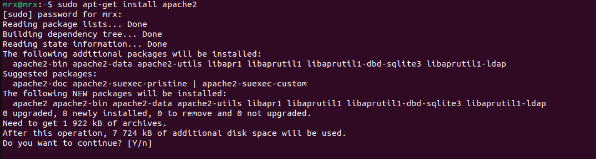

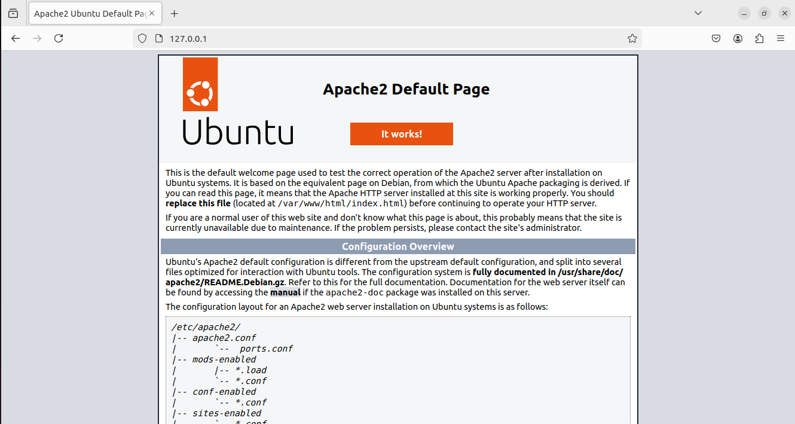

7) Запустим сканирование с помощью Nikto

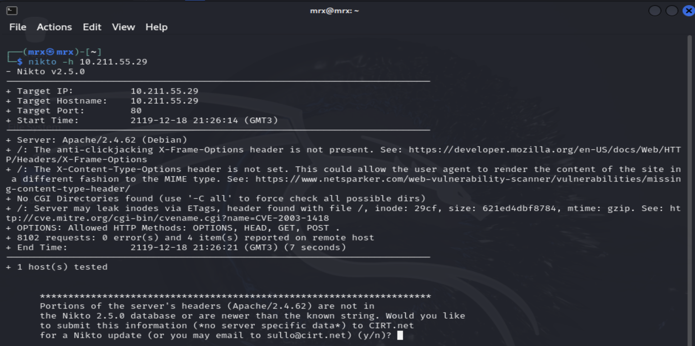

8) Смотрим вывод полученный от Suricata

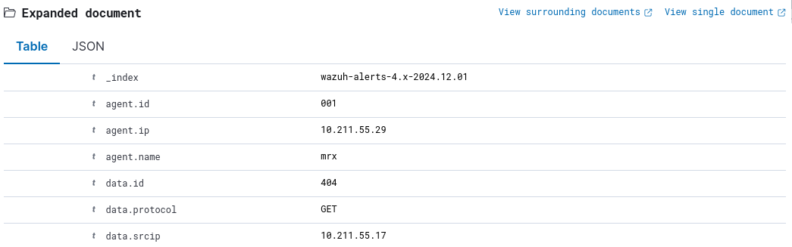

9) Устанавливаем и запускаем YARA

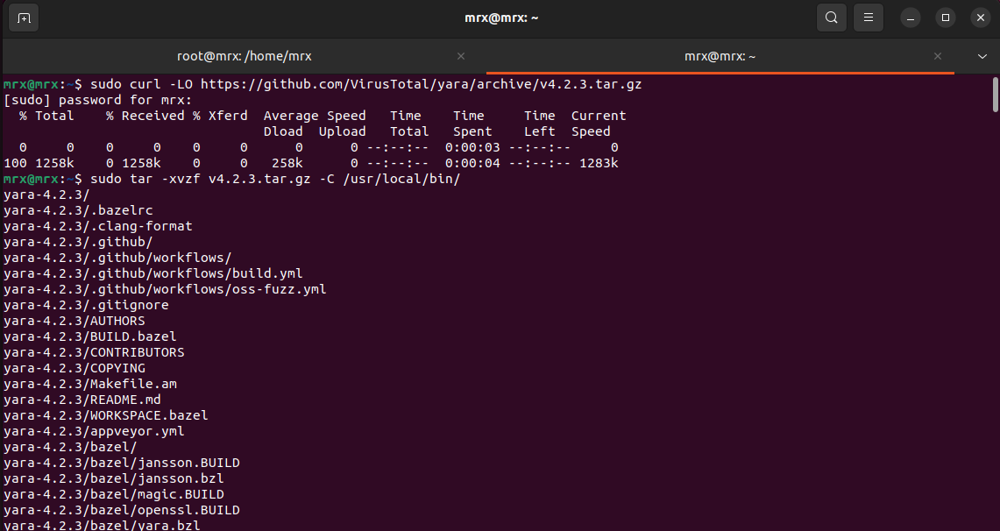

10) Скачиваем набор правил

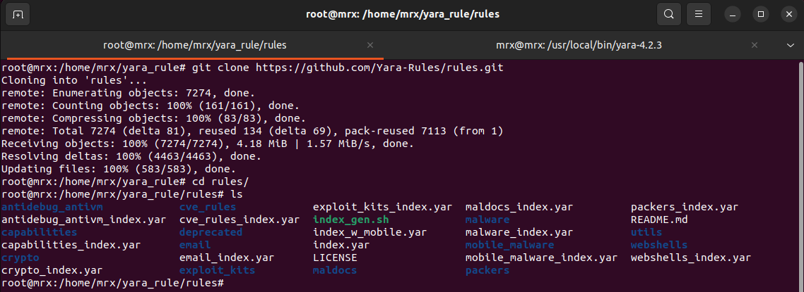

11) Создаем конфигурацию для YARA

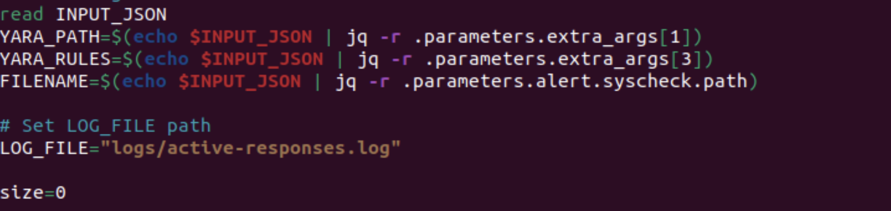

12) Добавляем в Wazuh

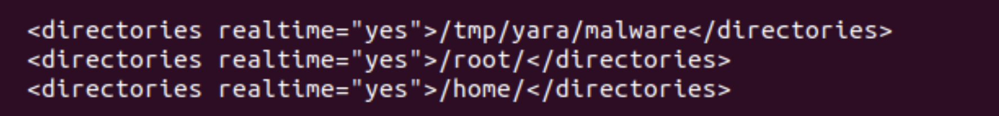

13) Проводим настройку на сервере

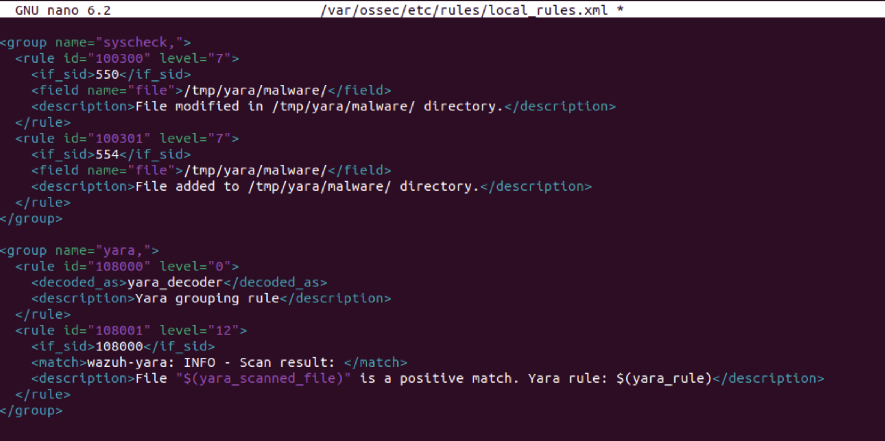

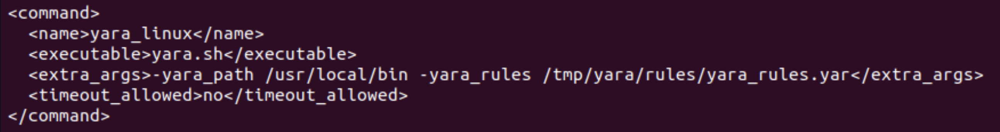
