# Практическая работа № 1: Сбор логов
## Выполнил Панков Никита Олегович, группа ББМО-01-23
## Цель работы: 
- Создать 2 виртуальные машины на базе ОС Debian 12
- Обеспечить между ними сетевой обмен
- Включить на 1й из ВМ передачу логов по протоколу rsyslog на 2ю ВМ
- Установить и настроить получение логов на сервер с использованием Loki
- Установить и настроить получение логов на сервер с использованием Loki (signoz.io)

## Ход работы

## `rsyslog`

### Установка `rsyslog` на сервер

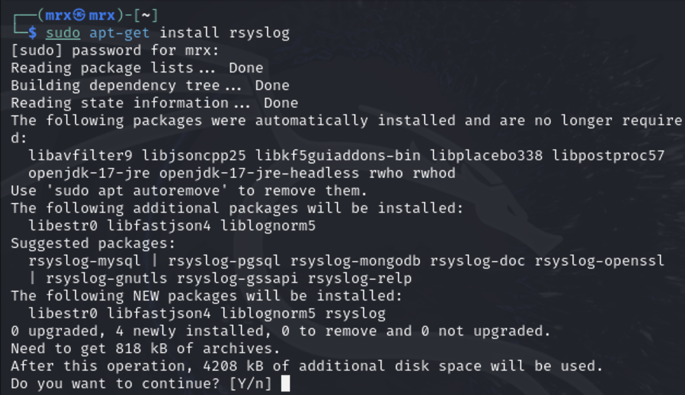

### Настройка модулей и добавление правил`rsyslog`

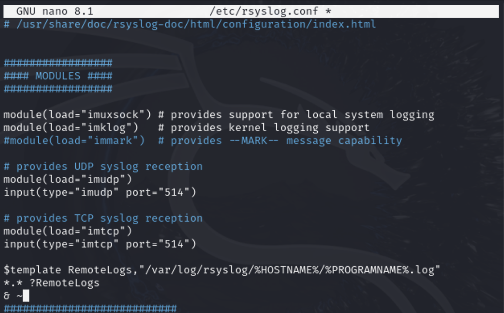

### Применение конфигурации `rsyslog`

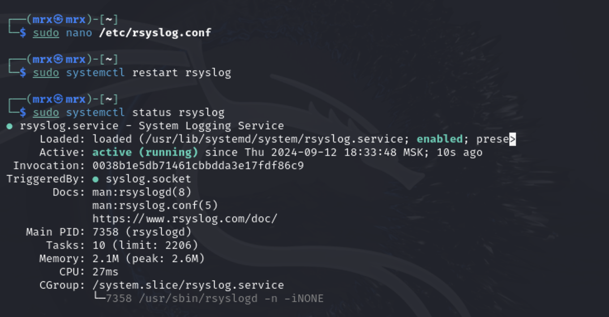

### Установка `rsyslog` на клиент

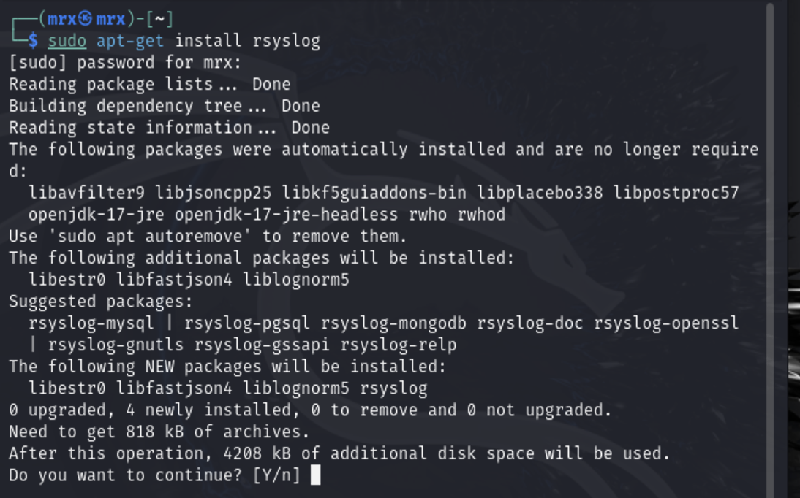

### Добавление правила пересылки логов на сервер

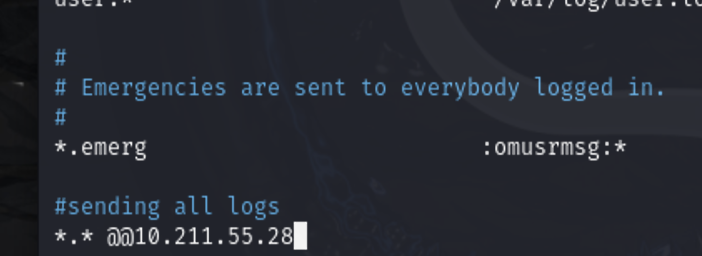

### Применение конфигурации `rsyslog`

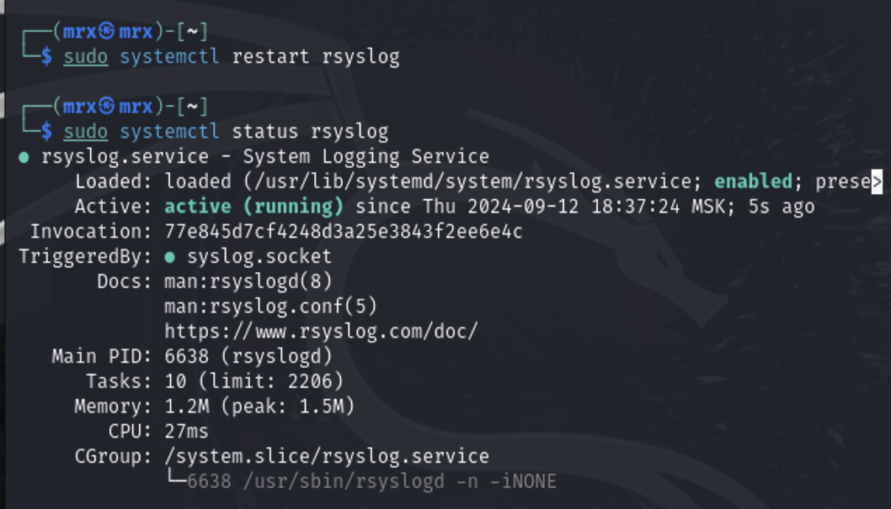

### Просмотр полученных логов на сервере

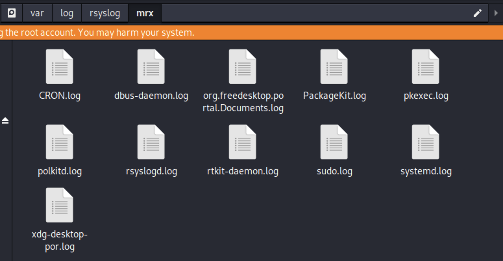

## Loki

### Загрузка compose-файла от разработчика

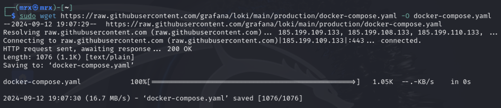
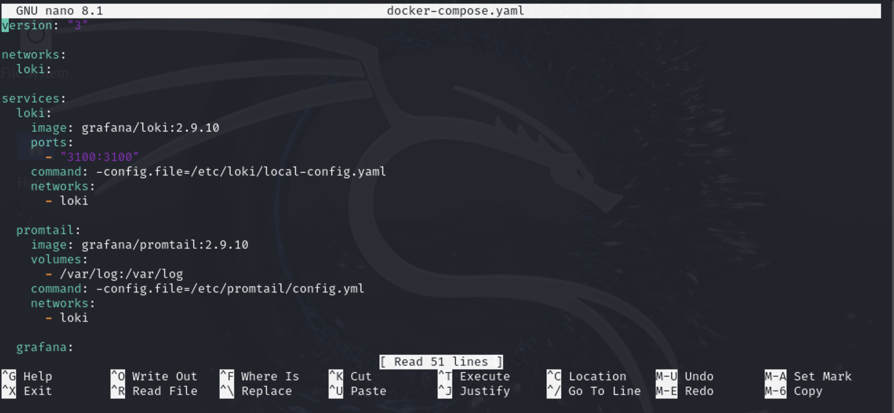

### Запуск Loki

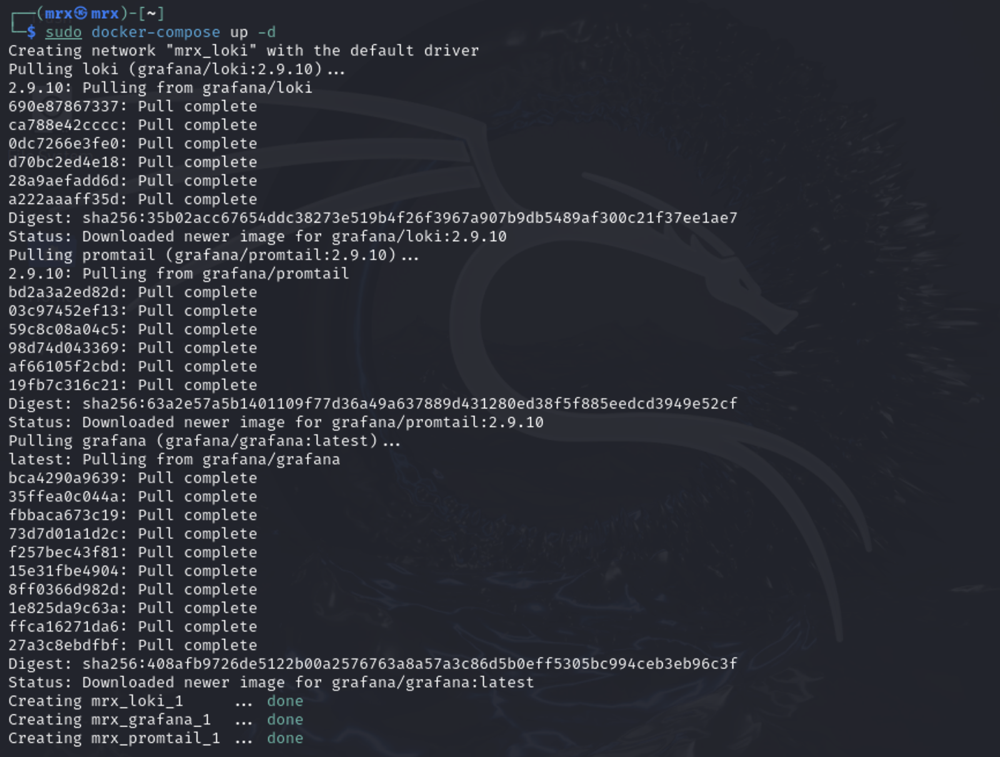
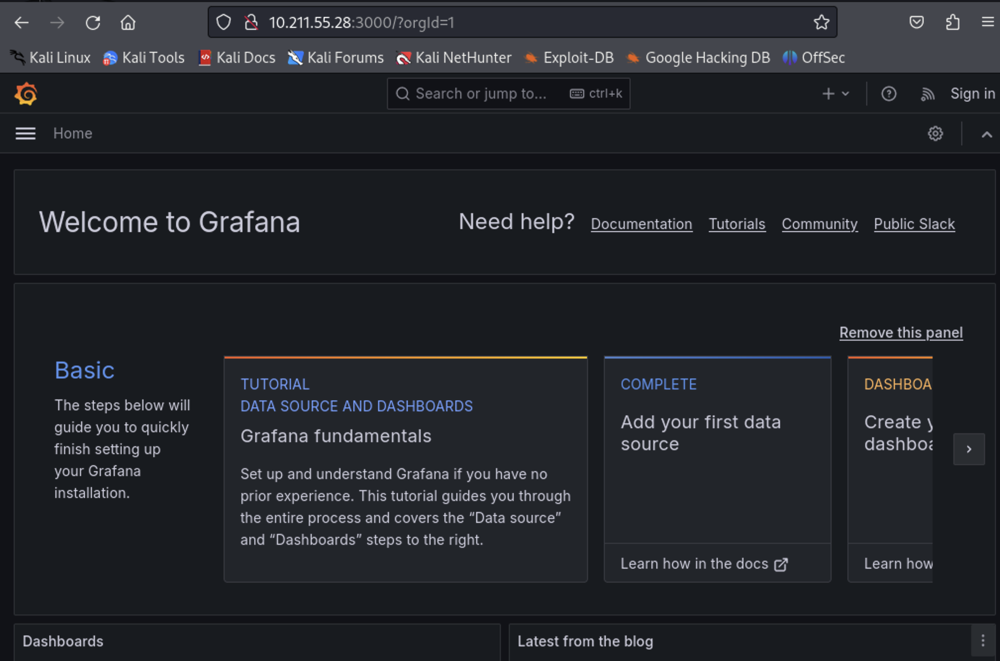

### Редактирование конфигурации `promtail` на клиенте

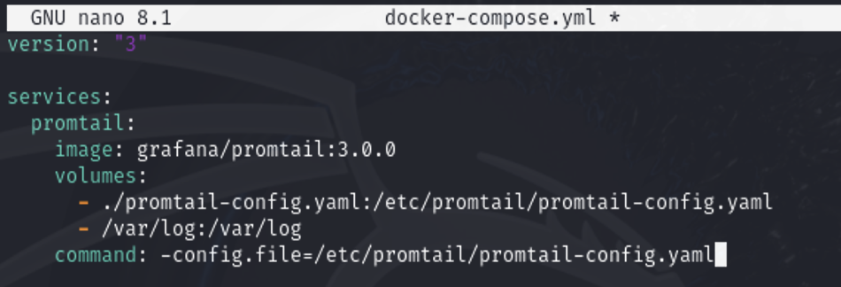
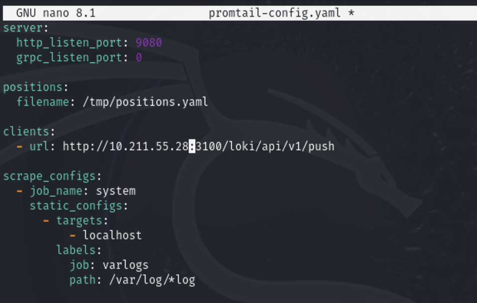

### Запуск `promtail` на клиенте

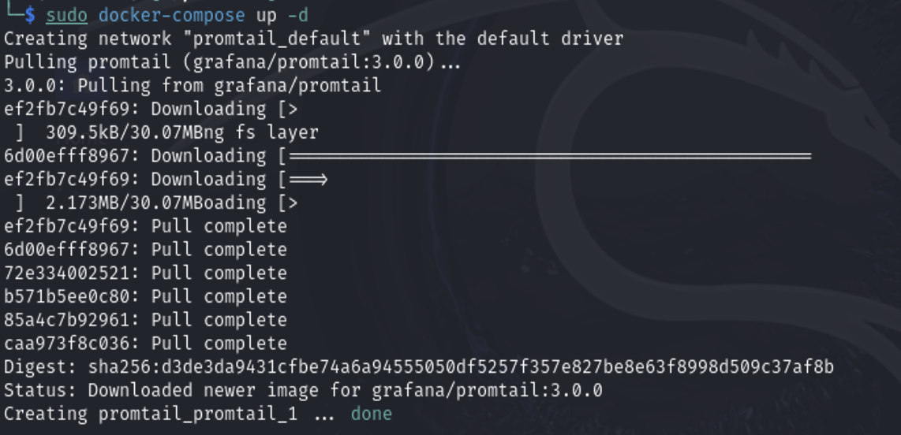

### Просмотр логов клиента в Grafana

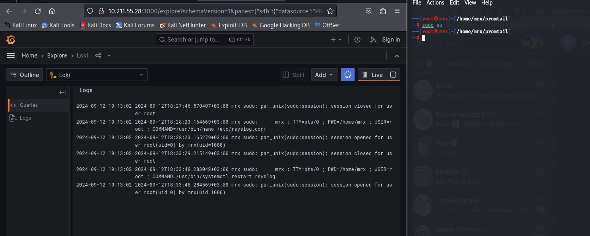

## Signoz

### Запуск Signoz

### Установка `Signoz` на сервер

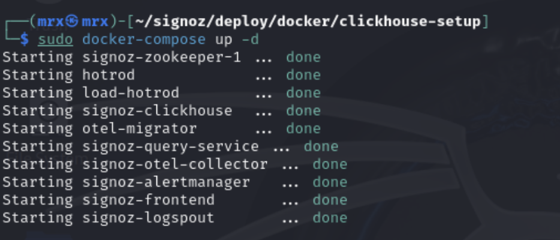

### Рабочая панель Signoz

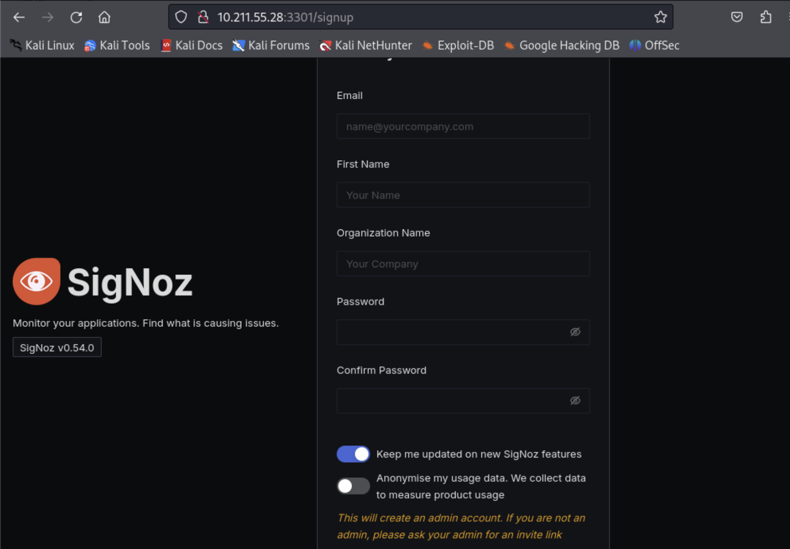

### Редактирование конфигурации клиентского приложения для отправки данных в Signoz

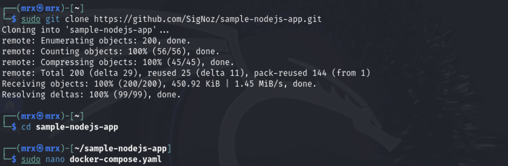

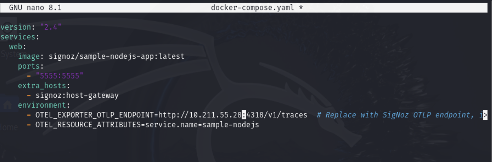

### Запуск клиентского приложения

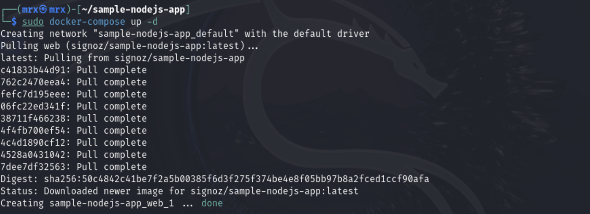

### Информация о приложении в Signoz

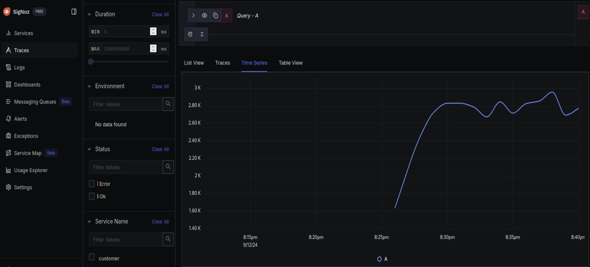

